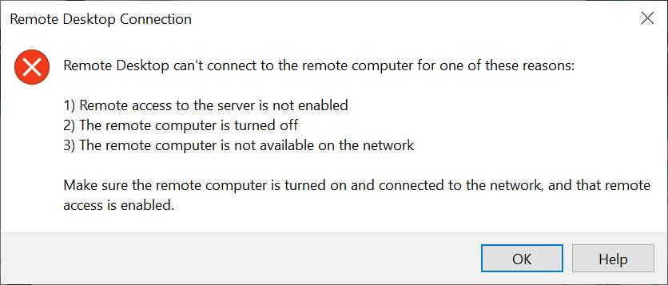

# Troubleshooting

- Consider using the virtual reading room when others aren't using your internet for high bandwidth activities (e.g. Zoom).
- Use a secure, password-protected network (i.e. not an open, public wifi connection).
- If you're on a VPN, you may have a slower viewing experience.

## Connecting

If you see this message and cannot connect, make sure you [signed into the VCL website and clicked "Connect!"](/user-guide/authenticating/#obtain-your-virtual-reading-room-credentials)

## Video

- Videos are best experienced on Windows computers.
- If you have a 4K resolution monitor, adjust your desktop resolution to 1920x1080.
- For optimal video quality, decrease the size of the video, so that it’s not full screen.

## Need help?

Email us at library_specialcollections@ncsu.edu.
