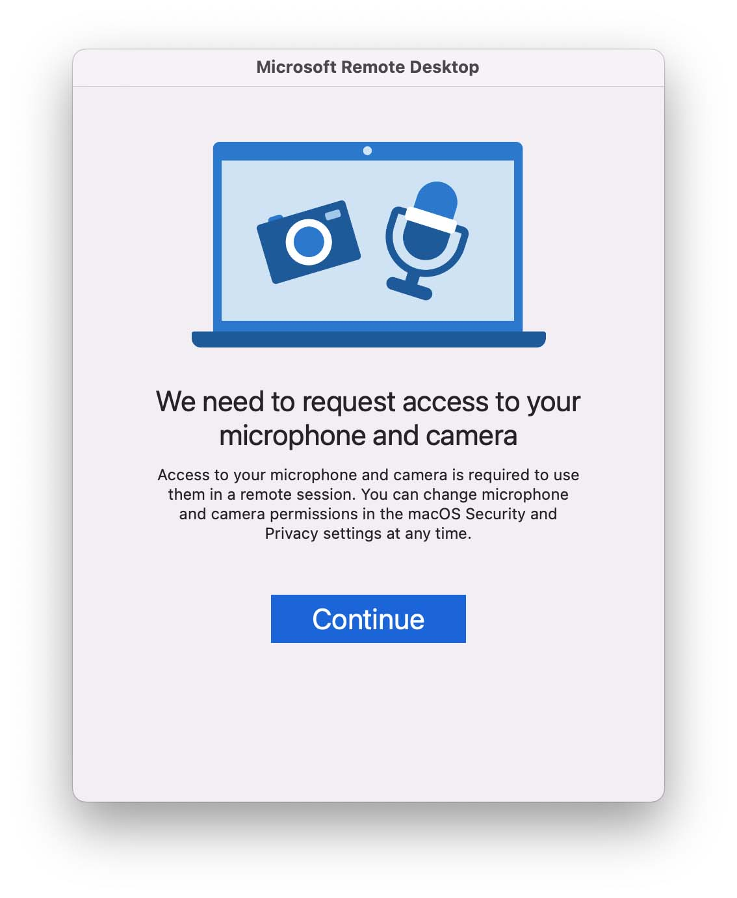
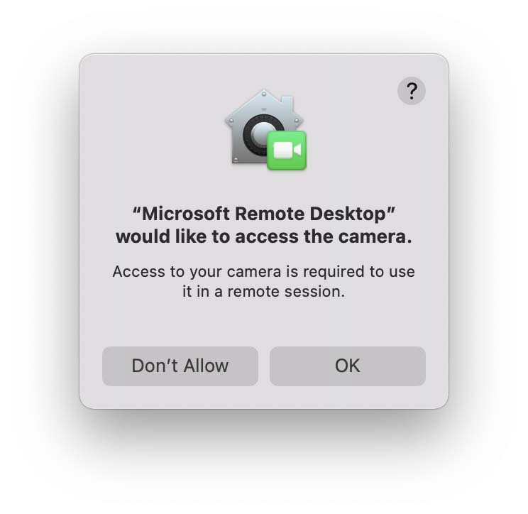
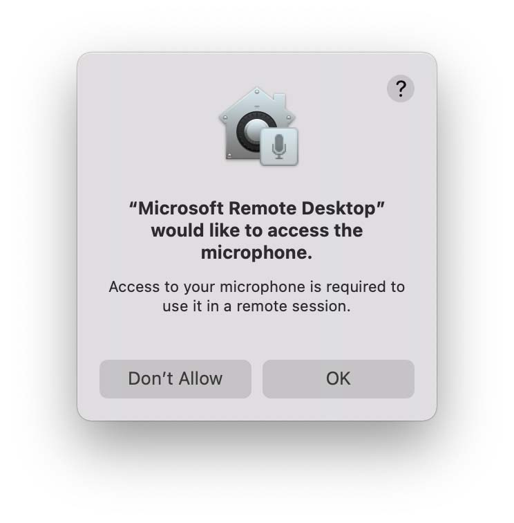
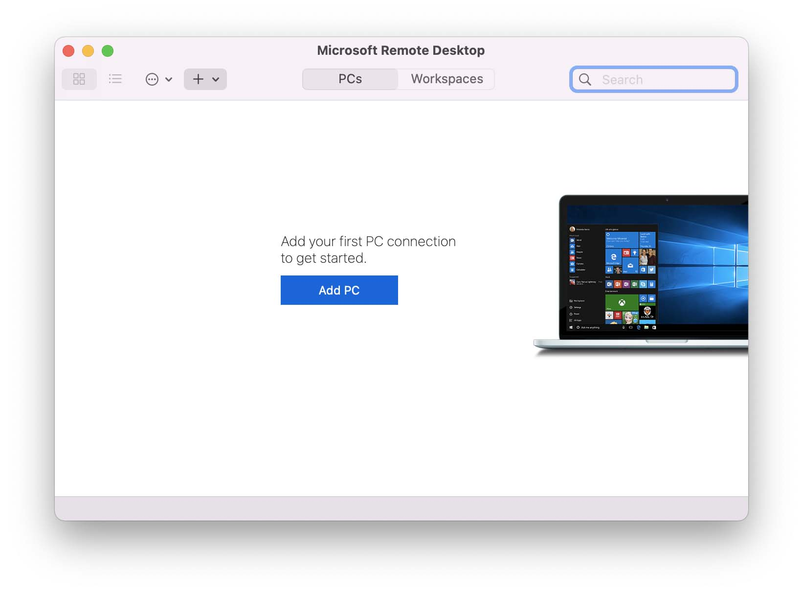
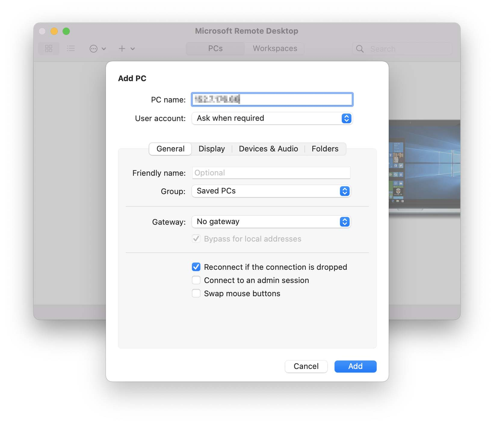
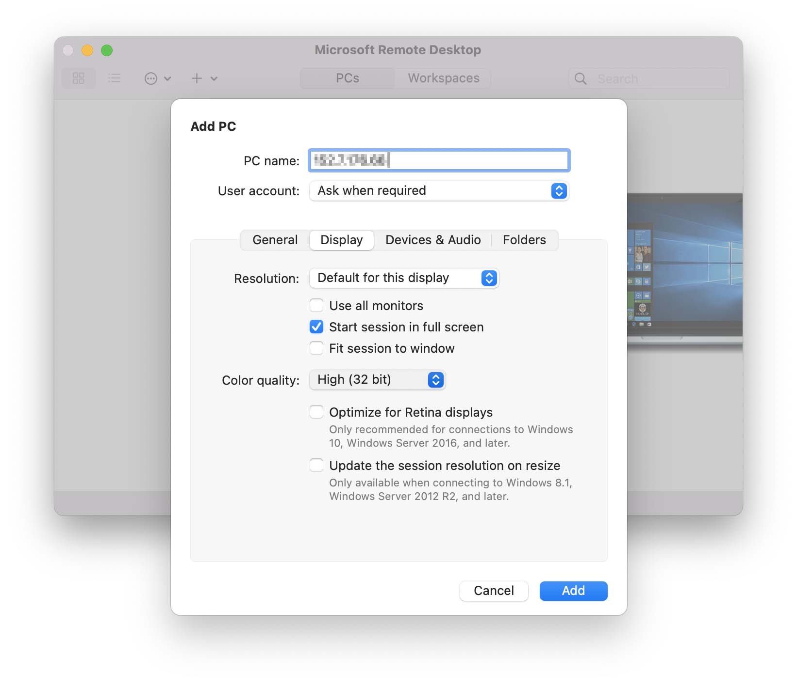
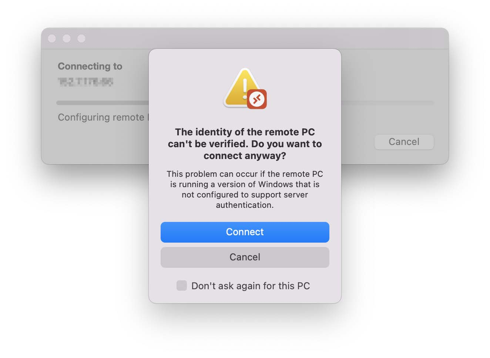
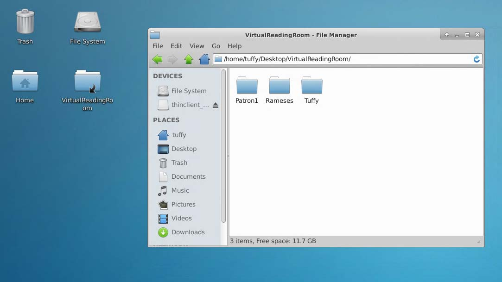
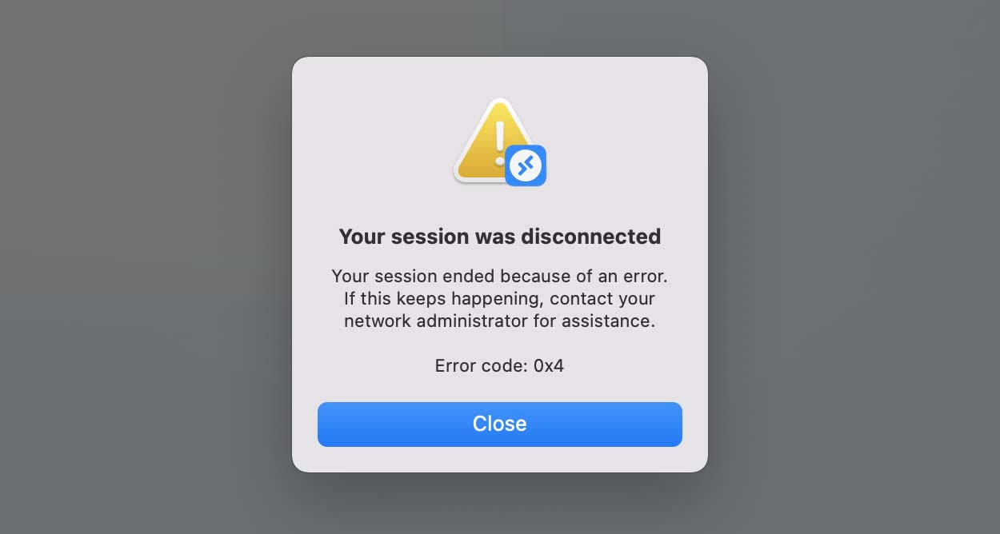

# Connecting from Mac

## Install Microsoft Remote Desktop

Download and install [Microsoft Remote Desktop](https://apps.apple.com/us/app/microsoft-remote-desktop/id1295203466?mt=12) from the Mac App Store. You may need to login with your Apple ID.

> <svg width="24" height="24" fill="none" viewBox="0 0 24 24">
  <path stroke="#c00" stroke-linecap="round" stroke-linejoin="round" stroke-width="2" d="M12 13V15"></path>
  <circle cx="12" cy="9" r="1" fill="#c00"></circle>
  <circle cx="12" cy="12" r="7.25" stroke="#c00" stroke-linecap="round" stroke-linejoin="round" stroke-width="1.5"></circle>
</svg> If you have an NC State Unity ID, you may also download this from the Self Service application.

## Open Microsoft Remote Desktop

When you first open Microsoft Remote Desktop, you may see a window pop-up that says, "We need to request access to your microphone and camera." Click on Continue. 

Then a window that says, "Microsoft Remote Desktop would like access to the camera." You can click on "Don't Allow."

You can also click on "Don't Allow" for a window that says, "Microsoft Remote Desktop would like to access the microphone."

## Add a connection

Click either the blue "Add PC" button. Alternatively, you can click the "+" icon near the top and select "Add PC."

For PC Name, enter the Remote Computer number you wrote down earlier.

## Adjust your settings

Under the Display tab, set Color quality to 32 bit. Then click the blue Add button.

## Connect to the virtual reading room

Double click on the tile which has the PC Name you just added.

If prompted with, “The identity of the remote PC can’t be verified,” click Connect.

## Log into the virtual reading room

Enter the username and password you wrote down earlier.

> <svg width="24" height="24" fill="none" viewBox="0 0 24 24">
  <path stroke="#c00" stroke-linecap="round" stroke-linejoin="round" stroke-width="2" d="M12 13V15"></path>
  <circle cx="12" cy="9" r="1" fill="#c00"></circle>
  <circle cx="12" cy="12" r="7.25" stroke="#c00" stroke-linecap="round" stroke-linejoin="round" stroke-width="1.5"></circle>
</svg> If you see a message that says, “Welcome to the first start of the panel,” select “Use default config.”

> <svg width="24" height="24" fill="none" viewBox="0 0 24 24">
  <path stroke="#c00" stroke-linecap="round" stroke-linejoin="round" stroke-width="2" d="M12 13V15"></path>
  <circle cx="12" cy="9" r="1" fill="#c00"></circle>
  <circle cx="12" cy="12" r="7.25" stroke="#c00" stroke-linecap="round" stroke-linejoin="round" stroke-width="1.5"></circle>
</svg> If you are asked whether you’d like to upgrade Ubuntu, select “Don’t Upgrade.”

## View your materials

When you are on the Desktop, go to the VirtualReadingRoom folder. Then open the folder which has your name.

## Request reproductions

If you’d like to request reproductions, copy those files into DuplicationsRequests, which is located in the folder with your name. Fill out the [duplication request](https://www.lib.ncsu.edu/sites/default/files/files/images/REPRODUCTION%20REQUEST%20FORM%20FOR%20SCRC.pdf) form we emailed you, and then email us your completed form.

## End your session

Go to the top right corner of the Desktop, click on your username, and select Log Out. Then click on Log Out (do not click on Shut Down).

If you see a window that says, "Your session was disconnected," click Close.

