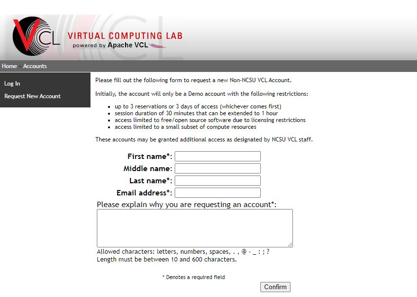

# 1. Creating an account

## Sign up for an external account

> <svg width="24" height="24" fill="none" viewBox="0 0 24 24">
  <path stroke="#c00" stroke-linecap="round" stroke-linejoin="round" stroke-width="2" d="M12 13V15"></path>
  <circle cx="12" cy="9" r="1" fill="#c00"></circle>
  <circle cx="12" cy="12" r="7.25" stroke="#c00" stroke-linecap="round" stroke-linejoin="round" stroke-width="1.5"></circle>
</svg>

If you have an NC State Unity ID or UNC System institutional login, skip to the [authenticating instructions](../authenticating).

If not, create a non-NCSU account at <https://vcl.ncsu.edu/accounts/site.php/newaccount.php>. 

Enter your name and email address. Under "Please explain why you are requesting an account," enter: `Using Libraries virtual reading room.`

## Activate your account

After creating your account, you will receive an email from vcl_help@ncsu.edu requiring activation of your account within 3 days.

## Email us

Once you have activated your account, let us know by emailing library_specialcollections@ncsu.edu, and confirm which email address you used to sign up. **We will then enable access to the virtual reading room and get back to you in about 2-3 days.**